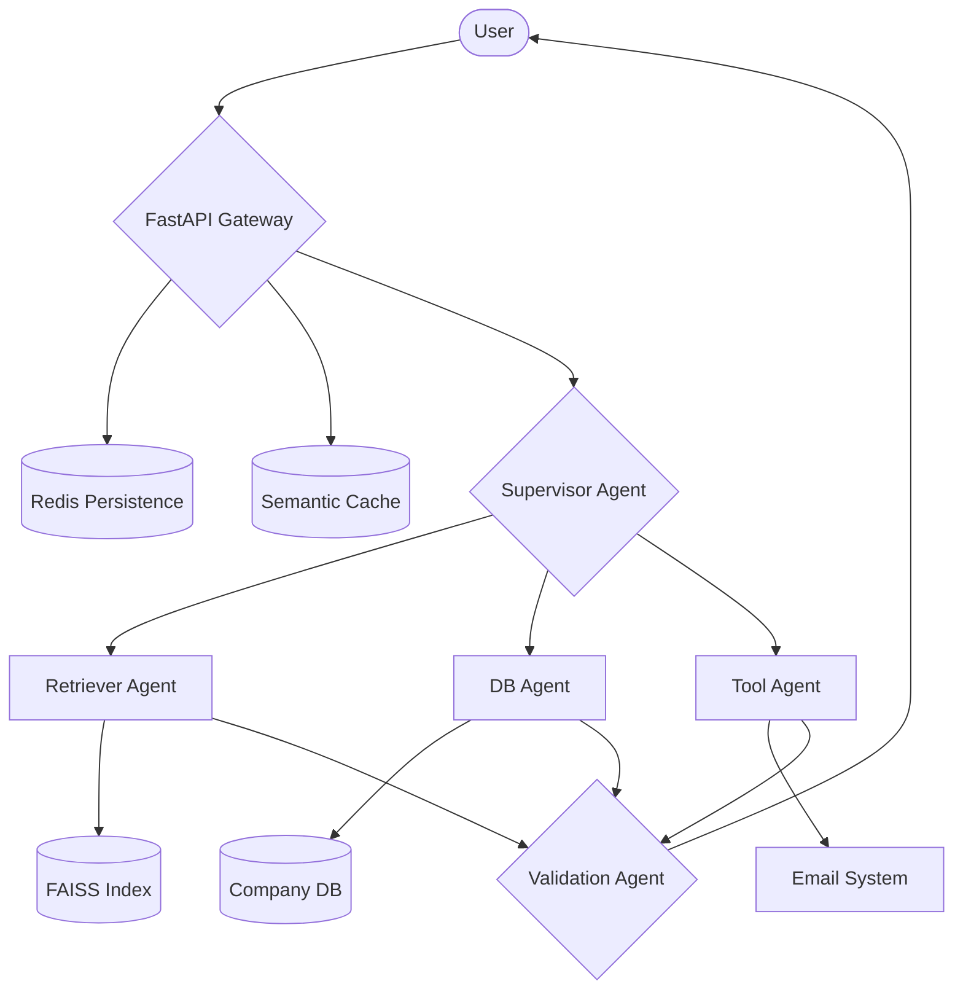

#  NexusAI: Enterprise Agentic RAG Orchestrator


NexusAI is a production-grade **Multi-Agent Agentic RAG** system designed for complex enterprise workflows. Unlike standard RAG loops, NexusAI utilizes a specialized **Supervisor-Worker** architecture to orchestrate document retrieval, structured data analysis, and external tool execution with human-in-the-loop safety.

---

## 🧠 Core Implementation Details

### 1. Agentic Orchestration (CEO Pattern)
At the heart of NexusAI is a **Supervisor Agent** that acts as an intelligent router.
- **Dynamic Routing**: Instead of querying all data, the Supervisor classifies user intent and delegates to specialized workers: `Retriever Agent`, `DB Agent`, or `Tool Agent`.
- **Validation Layer**: Every response passes through a **Validation Agent** (The Compliance Officer) which checks for hallucinations against the retrieved context and conversation history.

### 2. Advanced RAG Pipeline
- **Agentic Semantic Chunking**: We use embedding similarity analysis to detect "thematic breaks" in text. Documents are split where meaning shifts, not just at character limits, ensuring high-fidelity retrieval.
- **Hybrid Retrieval**: Powered by **FAISS (Dense)** for semantic matching and **BM25 (Sparse)** for keyword precision, coupled with a Cross-Encoder Reranker.
- **Semantic Caching**: A Redis-powered cache stores question embeddings. Similar repeating queries bypass the LLM entirely, reducing latency by 90% and cutting API costs.

### 3. Safety & Workflow
- **Human-in-the-Loop (HitL)**: For external actions (like sending emails), the **Tool Agent** follows a strict `Draft -> Confirm -> Execute` protocol. No action is taken without explicit user consent.
- **Multi-Format Support**: Native ingestion for `PDF`, `Markdown`, `DOCX`, and `CSV` files.

---

## 🛠️ Tech Stack

- **Orchestration**: LangGraph, LangChain (Python)
- **Frontend**: Next.js 14, TypeScript, Lucide Icons, Vanilla CSS (Stripe-style)
- **Vector DB**: FAISS
- **Memory/Cache**: Redis (Hybrid implementation with local fallback)
- **LLMs**: Groq (Llama 3), OpenAI (GPT-4o-mini), Hugging Face (Embeddings)

---

## 🚀 Setup & Installation

### 1. Backend Setup
1. **Activate Environment**:
   ```bash
   python3 -m venv venv
   source venv/bin/activate
   ```
2. **Install Core Dependencies**:
   ```bash
   pip install -r requirements.txt
   pip install docx2txt pandas # For DOCX and CSV support
   ```
3. **Configure Environment**:
   ```bash
   cp .env.example .env # Add your GROQ_API_KEY / OPENAI_API_KEY
   ```
4. **Run Server**:
   ```bash
   python3 -m uvicorn app:app --reload
   ```

### 2. Frontend Setup
1. **Install & Run**:
   ```bash
   cd frontend
   npm install
   npm run dev
   ```

---

## 📐 Architecture Overview



