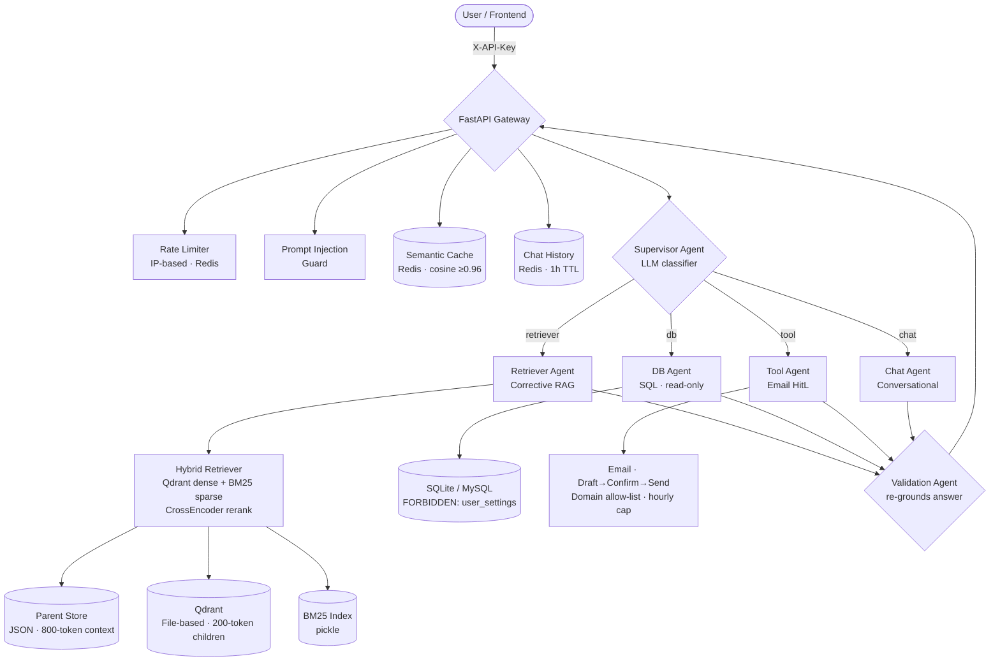

#  NexusAI: Enterprise Agentic RAG Orchestrator


NexusAI is a production-grade **Multi-Agent Agentic RAG** system designed for complex enterprise workflows. A **Supervisor→Worker→Validator** pipeline routes every query to the right specialist agent, with a LangGraph-powered Corrective RAG loop for high-fidelity retrieval and a strict human-in-the-loop protocol for external actions.

---

## Architecture Overview



---

## Core Implementation Details

### 1. Supervisor → Worker → Validator Pipeline

An LLM **Supervisor** classifies every message into one of four routes:

| Route | Agent | Capability |
|-------|-------|-----------|
| `retriever` | `RetrieverAgent` | Corrective RAG over company documents |
| `db` | `DBAgent` | Natural-language SQL over `company.db` / MySQL |
| `tool` | `ToolAgent` | Email with Draft → Confirm → Execute HitL |
| `chat` | `ChatAgent` | Conversational follow-ups and greetings |

Every agent output passes through a **Validation Agent** that re-grounds and normalises the answer into `{answer, source, confidence}` before returning to the caller.

### 2. Corrective RAG Loop (LangGraph)

`RetrieverAgent` implements a self-correcting retrieval graph:

```
retrieve → grade each doc → enough relevant? ──yes──→ generate answer
                                    │
                                   no (< top_k relevant, iterations < 2)
                                    │
                              rewrite query → retrieve again
```

- **Grader**: LLM scores each retrieved document as relevant/irrelevant; fail-opens on error.
- **Rewriter**: rewrites the query to be more search-friendly before retrying.
- **Max 2 iterations** to bound latency.

### 3. Parent-Child Chunking

Documents are split at two granularities:

| Level | Size | Purpose |
|-------|------|---------|
| **Child chunks** | 200 tokens | Stored in Qdrant — precise semantic retrieval |
| **Parent chunks** | 800 tokens | Stored in `ParentStore` (JSON) — richer LLM context |

After reranking, each retrieved child is swapped for its parent text before being passed to the answer LLM.

### 4. Hybrid Retrieval

`CompanyRetriever` runs a 4-stage pipeline on every query:

1. **Query rewrite** — LLM expands the query (acronyms, keywords)
2. **Dense search** — Qdrant `similarity_search` (top `retriever_top_k × 4`)
3. **Sparse search** — BM25 over the same corpus
4. **CrossEncoder rerank** — `cross-encoder/ms-marco-MiniLM-L-6-v2` scores all candidates; top `retriever_top_k` kept
5. **Parent expansion** — child chunks replaced with their 800-token parents

### 5. Security

- **Two-tier auth**: `X-API-Key` or `Authorization: Bearer` — `require_identity` for `/chat`, `require_admin` for `/settings`, `/upload`, `/documents`
- **Prompt injection guard**: 8-pattern substring check at the `/chat` boundary
- **SQL lockdown**: read-only SQLite URI (`mode=ro`), `user_settings` table hidden from the SQL agent
- **Upload sanitisation**: `os.path.basename`, extension allow-list, 20 MB size cap
- **Email guardrails**: domain allow-list, hourly send cap, Draft → Confirm → Execute protocol
- **Secret masking**: `/settings` GET returns `"***set***"` — never decrypts to caller
- **Rate limiting**: Redis `INCR` keyed on source IP, 10 req/min default

### 6. Scalability

- **Semantic cache**: Redis cursor-based `SCAN` (not blocking `KEYS`); cosine similarity ≥ 0.96 skips the full pipeline
- **Redis-backed indexing queue**: `INDEXING_QUEUE` is a Redis set (`nexusai:indexing_queue`) — safe across multiple workers
- **Qdrant lock safety**: retriever releases the file lock (`client.close()`) before background re-indexing runs
- **Pooled Redis client**: single connection reused across rate-limit and queue helpers

---

## Tech Stack

| Layer | Technology |
|-------|-----------|
| API | FastAPI (Python) |
| Orchestration | LangGraph, LangChain |
| LLMs | LiteLLM unified interface → Groq / OpenAI / Anthropic / Bedrock |
| Embeddings | `all-MiniLM-L6-v2` (HuggingFace, CPU) |
| Reranker | `cross-encoder/ms-marco-MiniLM-L-6-v2` (CPU) |
| Vector store | Qdrant (file-based, no server required) |
| Sparse retrieval | BM25 (rank-bm25) |
| Memory / Cache | Redis (graceful local-dict fallback) |
| Frontend | Next.js 14, TypeScript, Tailwind CSS |
| Tests | pytest (15 tests — import guard, encryption, auth, /health, contracts) |
| Observability | LangSmith (optional, via `LANGSMITH_API_KEY`) |
| Evaluation | RAGAS (faithfulness, answer relevancy, context recall) |

---

## Setup & Installation

### Backend

```bash
python3 -m venv venv
source venv/bin/activate
pip install -r requirements.txt

cp .env.example .env   # fill in API keys and MASTER_ENCRYPTION_KEY
python -m db.init_db   # seed demo DB
python -m rag.ingestion  # build Qdrant + BM25 indices

python -m uvicorn app:app --reload   # API on :8000
```

**Required `.env` keys:**

| Variable | Purpose |
|----------|---------|
| `MASTER_ENCRYPTION_KEY` | Fernet key — generate with `python -c "from cryptography.fernet import Fernet; print(Fernet.generate_key().decode())"` |
| `API_KEY` | Caller key for `/chat` |
| `ADMIN_API_KEY` | Admin key for `/settings`, `/upload`, `/documents` |
| `LLM_PROVIDER` | `groq` \| `openai` \| `anthropic` \| `bedrock` |
| `GROQ_API_KEY` / `OPENAI_API_KEY` | Provider key (whichever you use) |

Optional: `REDIS_URL`, `LANGSMITH_API_KEY`, `LANGCHAIN_PROJECT`, `ALLOWED_EMAIL_DOMAINS`, `CORS_ALLOWED_ORIGINS`.

### Frontend

```bash
cd frontend
cp .env.local.example .env.local   # set NEXT_PUBLIC_API_URL and NEXT_PUBLIC_API_KEY
npm install
npm run dev   # on :3000
```

### Tests

```bash
source venv/bin/activate
pytest tests/ -v
```

---

## Request Flow

```
POST /chat
  ├── Auth (require_identity)
  ├── Rate limit (Redis · source IP)
  ├── Prompt injection check
  ├── Semantic cache lookup (Redis · cosine ≥ 0.96)  → hit: return cached
  ├── Load chat history (Redis · 1h TTL)
  ├── Supervisor routes → Worker agent
  │     retriever → Corrective RAG loop (LangGraph)
  │                   retrieve → grade → [rewrite →] generate
  │     db        → SQL agent (read-only SQLite / MySQL)
  │     tool      → Email agent (Draft → Confirm → Execute)
  │     chat      → Conversational LLM
  ├── Validation Agent (re-grounds answer)
  ├── Save to Redis history + semantic cache
  └── Return {answer, source, confidence}
```
