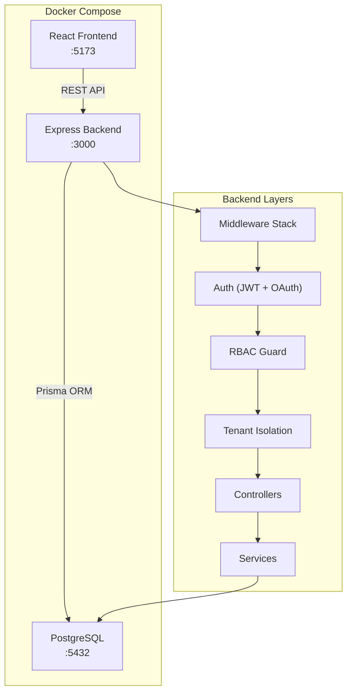
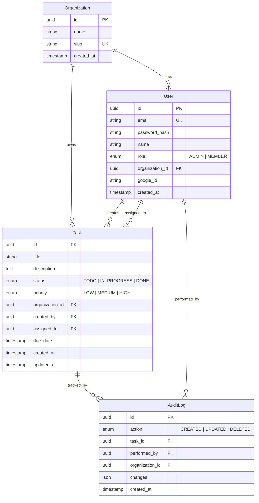

# Multi-Tenant Task Management System — Implementation Plan

A full-stack multi-tenant task management application with role-based access control, JWT authentication, Google OAuth, audit logging, and Docker containerization.

## Tech Stack

| Layer | Technology |
|-------|-----------|
| **Backend** | Node.js, Express.js |
| **Database** | PostgreSQL 15 |
| **ORM** | Prisma |
| **Auth** | JWT (access + refresh tokens), Google OAuth 2.0 |
| **Frontend** | React 18 (Vite), React Router, Axios |
| **Containerization** | Docker, Docker Compose |

## User Review Required

> [!IMPORTANT]
> **Google OAuth**: You will need to provide Google OAuth credentials (`GOOGLE_CLIENT_ID`, `GOOGLE_CLIENT_SECRET`) in the `.env` file for OAuth to work. The system will work without them (JWT login/register will still function), but the Google login button will be non-functional.

> [!NOTE]
> **Database**: The plan uses PostgreSQL via Docker. No local PostgreSQL installation is needed.

---

## Architecture Overview



## Database Schema



---

## Proposed Changes

### Backend — Project Structure

```
backend/
├── prisma/
│   └── schema.prisma          # Database models
├── src/
│   ├── server.js              # Entry point
│   ├── app.js                 # Express app setup
│   ├── config/
│   │   └── index.js           # Environment config
│   ├── middleware/
│   │   ├── auth.js            # JWT verification
│   │   ├── rbac.js            # Role-based access guard
│   │   ├── tenantIsolation.js # Org-scoping filter
│   │   ├── validate.js        # Request validation
│   │   └── errorHandler.js    # Global error handler
│   ├── routes/
│   │   ├── auth.routes.js     # Login, register, OAuth, refresh
│   │   ├── task.routes.js     # Task CRUD
│   │   ├── user.routes.js     # User management (admin)
│   │   └── audit.routes.js    # Audit log queries
│   ├── controllers/
│   │   ├── auth.controller.js
│   │   ├── task.controller.js
│   │   ├── user.controller.js
│   │   └── audit.controller.js
│   ├── services/
│   │   ├── auth.service.js
│   │   ├── task.service.js
│   │   ├── user.service.js
│   │   └── audit.service.js
│   └── utils/
│       ├── jwt.js             # Token generation/verification
│       └── errors.js          # Custom error classes
├── .env.example
├── Dockerfile
└── package.json
```

---

#### [NEW] [schema.prisma](file:///home/bhuvi/Desktop/acer/PROJECTS/New_Multi_Tenant_System/backend/prisma/schema.prisma)

Prisma schema with models: `Organization`, `User`, `Task`, `AuditLog`. All queries will be scoped to `organization_id` for tenant isolation.

#### [NEW] [app.js](file:///home/bhuvi/Desktop/acer/PROJECTS/New_Multi_Tenant_System/backend/src/app.js)

Express app with CORS, JSON parsing, route mounting, and global error handler.

#### [NEW] [auth.js middleware](file:///home/bhuvi/Desktop/acer/PROJECTS/New_Multi_Tenant_System/backend/src/middleware/auth.js)

Extracts and verifies JWT from `Authorization: Bearer <token>` header. Attaches `req.user` with `{ id, email, role, organizationId }`.

#### [NEW] [rbac.js middleware](file:///home/bhuvi/Desktop/acer/PROJECTS/New_Multi_Tenant_System/backend/src/middleware/rbac.js)

`authorize(...roles)` — factory that returns middleware checking `req.user.role` against allowed roles. Returns 403 if unauthorized.

#### [NEW] [tenantIsolation.js middleware](file:///home/bhuvi/Desktop/acer/PROJECTS/New_Multi_Tenant_System/backend/src/middleware/tenantIsolation.js)

Attaches `req.organizationId` from the authenticated user. All service-layer queries filter by this value.

#### [NEW] [auth.controller.js](file:///home/bhuvi/Desktop/acer/PROJECTS/New_Multi_Tenant_System/backend/src/controllers/auth.controller.js)

- `POST /api/auth/register` — Create org + admin user (or join existing org)
- `POST /api/auth/login` — Email/password login → access + refresh tokens
- `POST /api/auth/refresh` — Refresh token rotation
- `GET /api/auth/google` — Redirect to Google OAuth
- `GET /api/auth/google/callback` — Handle OAuth callback

#### [NEW] [task.controller.js](file:///home/bhuvi/Desktop/acer/PROJECTS/New_Multi_Tenant_System/backend/src/controllers/task.controller.js)

- `POST /api/tasks` — Create task (any authenticated user)
- `GET /api/tasks` — List tasks in org (with filters: status, priority, assignee)
- `GET /api/tasks/:id` — Get single task (org-scoped)
- `PUT /api/tasks/:id` — Update task (admin: any task; member: own tasks only)
- `DELETE /api/tasks/:id` — Delete task (admin: any task; member: own tasks only)

#### [NEW] [audit.controller.js](file:///home/bhuvi/Desktop/acer/PROJECTS/New_Multi_Tenant_System/backend/src/controllers/audit.controller.js)

- `GET /api/audit-logs` — List audit logs (org-scoped, admin only)
- `GET /api/audit-logs/task/:taskId` — Logs for specific task

#### [NEW] [user.controller.js](file:///home/bhuvi/Desktop/acer/PROJECTS/New_Multi_Tenant_System/backend/src/controllers/user.controller.js)

- `GET /api/users` — List users in org (admin only)
- `PUT /api/users/:id/role` — Change user role (admin only)
- `DELETE /api/users/:id` — Remove user from org (admin only)

---

### Frontend — Project Structure

```
frontend/
├── src/
│   ├── main.jsx
│   ├── App.jsx                # Router setup
│   ├── api/
│   │   └── axios.js           # Axios instance with interceptors
│   ├── context/
│   │   └── AuthContext.jsx    # Auth state management
│   ├── components/
│   │   ├── Layout.jsx         # Sidebar + header shell
│   │   ├── ProtectedRoute.jsx # Auth guard wrapper
│   │   ├── TaskCard.jsx
│   │   ├── TaskForm.jsx
│   │   └── TaskFilters.jsx
│   ├── pages/
│   │   ├── Login.jsx
│   │   ├── Register.jsx
│   │   ├── Dashboard.jsx
│   │   ├── Tasks.jsx
│   │   ├── AuditLogs.jsx
│   │   └── AdminPanel.jsx
│   └── index.css
├── Dockerfile
├── nginx.conf                 # Production reverse proxy
└── package.json
```

#### Key Pages

| Page | Description |
|------|-------------|
| **Login** | Email/password + Google OAuth button |
| **Register** | Create account + new org or join with invite code |
| **Dashboard** | Task stats, recent activity, quick actions |
| **Tasks** | Full task list with filters, create/edit/delete modals |
| **Audit Logs** | Paginated log table (admin only) |
| **Admin Panel** | User list, role management (admin only) |

---

### Docker

#### [NEW] [backend/Dockerfile](file:///home/bhuvi/Desktop/acer/PROJECTS/New_Multi_Tenant_System/backend/Dockerfile)

Multi-stage Node.js build: install deps → generate Prisma client → run.

#### [NEW] [frontend/Dockerfile](file:///home/bhuvi/Desktop/acer/PROJECTS/New_Multi_Tenant_System/frontend/Dockerfile)

Multi-stage: build React app → serve with nginx.

#### [NEW] [docker-compose.yaml](file:///home/bhuvi/Desktop/acer/PROJECTS/New_Multi_Tenant_System/docker-compose.yaml)

Three services:
- `db` — PostgreSQL 15 with volume persistence
- `backend` — Express API, depends on db
- `frontend` — Nginx serving React, proxies `/api` to backend

---

## RBAC Permission Matrix

| Action | ADMIN | MEMBER |
|--------|-------|--------|
| Create task | ✅ | ✅ |
| View all org tasks | ✅ | ✅ |
| Update any task | ✅ | ❌ (own only) |
| Delete any task | ✅ | ❌ (own only) |
| View audit logs | ✅ | ❌ |
| Manage users/roles | ✅ | ❌ |

---

## Verification Plan

### Automated Tests

1. **API endpoint tests** using the browser tool against the running dev server:
   - Register a new admin user → verify 201 + tokens returned
   - Login with credentials → verify JWT in response
   - Create task → verify it appears in GET /api/tasks
   - Try cross-org access → verify 403
   - Member tries to delete another user's task → verify 403
   - Admin deletes any task → verify 200
   - Verify audit log entries created for task operations

2. **Docker build verification**:
   ```bash
   docker compose build    # Verify builds succeed
   docker compose up -d    # Verify all services start
   docker compose ps       # Verify all containers healthy
   ```

### Manual Verification

1. **Open the app in browser** at `http://localhost:5173`
2. Register two separate organizations with different admin users
3. Create tasks in Org A → verify they don't appear in Org B
4. Add a member user to Org A → verify they can only edit/delete their own tasks
5. Check audit logs page shows task creation/update history
6. Test Google OAuth flow (requires valid credentials in `.env`)
